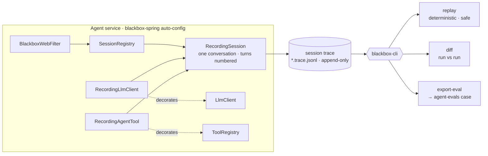

# agent-blackbox

[](https://github.com/hhagenbuch/agent-blackbox/actions/workflows/ci.yml)


> When an agent misbehaves in production, you get a support ticket and a shrug.
> There's no stack trace for "it chose the wrong tool and then lied about it."
> `agent-blackbox` is the flight recorder: every session is captured as an
> append-only trace — messages, tool calls, model/provenance, timings — that you
> can **replay deterministically** (no API key, no side-effects), **diff**
> against another run, and **export as a regression eval** so the same failure
> can never ship again.

**Every production incident becomes a permanent eval case with one command.**
Debugging and testing stop being separate activities.

**Status: MVP.** Record (zero starter changes), replay (safe + judgmental), diff,
and export-eval all work. Design and format:
[`docs/DESIGN.md`](docs/DESIGN.md), [`docs/TRACE-FORMAT.md`](docs/TRACE-FORMAT.md).

```console
$ blackbox export-eval incident.trace.jsonl --turn 1 --out cases/incident-1234.yaml
# → an agent-evals case: the prompt, tool_called assertions from the real
#   trajectory, and a judge stub for a human to confirm. Every incident becomes
#   a regression test.
```

## Architecture

Recording decorates the starter's seams; a whole conversation is one
append-only trace; the CLI turns that trace into replay, diff, and eval cases.



## How it works

1. **Record** — add the `blackbox-spring` dependency to an agent service and
   every session is written to a `*.trace.jsonl` flight record. **Zero code
   changes**: it decorates the seams (`LlmClient`, `ToolRegistry`) the agent
   already has.
2. **Replay** — `blackbox replay trace.jsonl` re-runs the session against a
   headless harness: recorded model responses are fed back (no key, no network),
   recorded tool results are returned (**no side-effects — a replay never
   re-sends an email**), and the replayer compares what the *current* code does
   against the trace. Faithful → exit 0; **diverged → exit 1 with a precise
   report** ("turn 3: live called `clock`, trace recorded `calculator`").
3. **Diff** — `blackbox diff a.trace.jsonl b.trace.jsonl` aligns two runs of the
   same conversation turn-by-turn: answer similarity, tool-call differences,
   token/latency deltas. (Pairs with a canary vs. main comparison.)
4. **Export** — `blackbox export-eval trace.jsonl --turn 3 --out case.yaml`
   turns a recorded turn into an [agent-evals](https://github.com/hhagenbuch/agent-evals)
   case: the prompt, `tool_called` assertions from the real trajectory, and a
   `judge` stub for a human to confirm.

Replay re-runs the **real agent** over the recorded inputs — a `ReplayLlmClient`
feeds the recorded model responses (no key, no network) and the recorded prompt
drives the loop — and reports where current code now behaves differently
(different request to the model, different tool call, or a changed result):

```console
$ blackbox replay incident.trace.jsonl
replay: faithful — current code reproduces the recorded trajectory   # exit 0

$ blackbox replay incident.trace.jsonl --execute calculator          # after a tool regression
replay: DIVERGED (1)
  ✗ [tool.result] calculator (tu1): recorded "468013", got "999999"  # exit 1
```

**Tools are never executed on replay by default** — recorded results are
authoritative, so a replay of a session that sent an email *cannot send it
again*. `--execute <tool>` opts a specific (safe) tool back in for behavioral
comparison. This is its own test.

It closes a loop no single repo can:
[spring-ai-agent-starter](https://github.com/hhagenbuch/spring-ai-agent-starter)
produces behavior → **agent-blackbox captures it** →
[agent-evals](https://github.com/hhagenbuch/agent-evals) enforces it.

## Modules

| Module | Contents |
|---|---|
| `blackbox-core` | trace model, JSONL reader/writer, redaction, diff engine, eval exporter (Jackson only) |
| `blackbox-spring` | Spring Boot auto-config + recording decorators for `LlmClient` / `ToolRegistry` |
| `blackbox-cli` | `replay`, `diff`, `export-eval`, `stats` (shaded jar) |

## Design highlights

- **Failures are events, not gaps** — an error mid-turn is recorded exactly where
  it happened. Debugging the *bad* runs is the whole point.
- **Digest-by-default** — full request payloads aren't stored unless
  `--capture-full`; a `messagesDigest` keeps traces small and privacy-sane while
  still catching divergence. Redaction runs **on write** and marks scrubbed
  spans (`"redacted": true`) rather than silently altering them.
- **Replay safety is non-negotiable** — recorded tool results are replayed;
  real transports are never invoked. It has its own test.

## Roadmap

- [ ] Phase 0 — design doc + trace schema (this)
- [x] Phase 1 — `blackbox-core`: format + reader/writer (truncation-tolerant) + redaction
- [x] Phase 2 — `blackbox-spring`: decorate-the-seam recording, zero target changes
- [x] Phase 3 — replay + divergence detection (safe: recorded tool results, stubbed side-effects)
- [x] Phase 4 — `diff` + `export-eval` (emits valid agent-evals YAML)
- [ ] Later — cross-repo eval run in CI; loop-replay from prompt; trace viewer; README GIF

## License

MIT — see [LICENSE](LICENSE).
